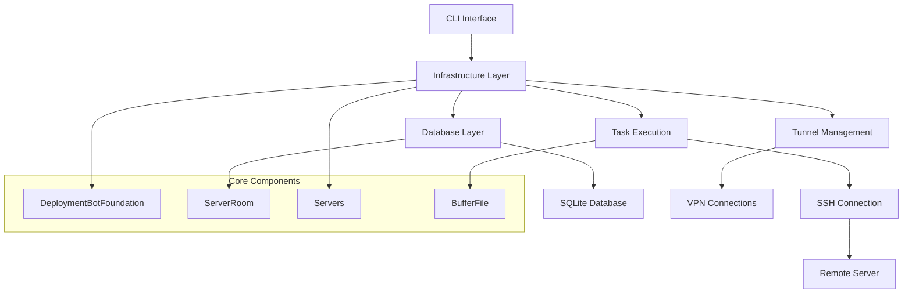

# MachineRoom Developer Guide

## Table of Contents

1. [Overview](#overview)
2. [Architecture](#architecture)
3. [Getting Started](#getting-started)
4. [Core Components](#core-components)
5. [Building Custom Programs](#building-custom-programs)
6. [Server Management Examples](#server-management-examples)
7. [Advanced Features](#advanced-features)
8. [Best Practices](#best-practices)
9. [Troubleshooting](#troubleshooting)

## Overview

MachineRoom is a Python-based framework for managing multiple remote servers from a single console. It provides a robust foundation for building server management applications with features like:

- **Multi-server orchestration** - Manage hundreds of servers from one interface
- **SSH automation** - Automated certificate deployment and connection management
- **Docker integration** - Container deployment and orchestration
- **VPN tunneling** - Support for various VPN protocols
- **Database persistence** - SQLite-based server metadata storage
- **Extensible architecture** - Easy to extend with custom functionality

## Architecture



## Getting Started

### 1. Installation

```bash
# Install from PyPI
pip3 install machineroom

# Or install from source
git clone https://github.com/jjhesk/mymachineroom.git
cd mymachineroom
pip3 install -e .
```

### 2. Basic Configuration

Create a configuration script:

```python
#!/usr/bin/env python3
# -*- coding: utf-8 -*-

from machineroom.const import Config

# Configure your data directory
Config.DATAPATH_BASE = "/Users/yourusername/.machineroom"

# Configure SSH key path
Config.PUB_KEY = "/Users/yourusername/.ssh/id_rsa.pub"

# Configure your email/identifier
Config.MY_KEY_FEATURE = "your-email@domain.com"

# Optional: Set minimum requirements
Config.RAM_GB_REQUIREMENT = 4
Config.DOCKER_COMPOSE_VERSION = "2.24.6"

from machineroom.worker import internal_work

if __name__ == '__main__':
    internal_work()
```

### 3. Create Server Configuration

Create a server list file in your `DATAPATH_BASE` directory:

```bash
# production_servers.txt
#prod-vpn--L2TP/IPSEC--vpn.company.com--vpnuser--vpnpass
web-01--192.168.1.100--root--password123--22
web-02--192.168.1.101--root--password123--22
db-primary--192.168.1.200--postgres--dbpass--5432
cache-redis--192.168.1.210--redis--cachepass--6379
```

## Core Components

### 1. DeploymentBotFoundation

The base class for all server management operations:

```python
from machineroom.taskbase import DeploymentBotFoundation
from fabric import Connection

class MyDeploymentBot(DeploymentBotFoundation):
    def __init__(self, server_room_file: str):
        super().__init__(server_room_file)
    
    def stage_0(self):
        """Pre-connection setup"""
        print(f"Preparing to connect to {self.srv.current_id}")
    
    def stage_1(self, c: Connection):
        """Main deployment logic"""
        # Your custom deployment code here
        pass
    
    def run_conn(self, callback_x=None):
        """Execute deployment across servers"""
        super().run_conn(callback_x)
```

### 2. ServerRoom Database

Manages server metadata and state:

```python
from machineroom.sql import ServerRoom

# Initialize database
db = ServerRoom()

# Set current server
db.set_server_id("web-01")

# Check if server exists
if db.has_this_server():
    print("Server found in database")

# Update server metadata
db.update_res_kv("custom_field", "value")
db.update_res_kv("deployment_status", "completed")

# Check installation status
if db.is_cert_installed():
    print("SSH certificate is installed")

# Mark as installed
db.cert_install()
```

### 3. Servers Class

Handles server configuration parsing and management:

```python
from machineroom.util import Servers

# Initialize with server file
servers = Servers("production_servers.txt")

# Detect servers in file
servers.detect_servers()

# Read server at index
servers.read_serv_at(0)
print(f"Current server: {servers.current_id} at {servers.current_host}")

# Move to next server
servers.use_next_node()

# Check tunnel configuration
if servers.has_tunnel():
    print(f"Tunnel profile: {servers.profile_name}")
```

## Building Custom Programs

### Example 1: Simple Server Health Checker

```python
#!/usr/bin/env python3
# -*- coding: utf-8 -*-

from machineroom.taskbase import DeploymentBotFoundation
from machineroom.const import Config
from fabric import Connection
import json

class HealthChecker(DeploymentBotFoundation):
    def __init__(self, server_room_file: str):
        super().__init__(server_room_file)
        self.health_results = {}
    
    def stage_0(self):
        print(f"🔍 Checking health of {self.srv.current_id}")
    
    def stage_1(self, c: Connection):
        """Perform health checks"""
        health_data = {}
        
        # Check disk space
        result = c.run("df -h /", warn=True)
        health_data['disk_usage'] = result.stdout.strip()
        
        # Check memory
        result = c.run("free -h", warn=True)
        health_data['memory_usage'] = result.stdout.strip()
        
        # Check running processes
        result = c.run("ps aux | wc -l", warn=True)
        health_data['process_count'] = result.stdout.strip()
        
        # Check network connectivity
        result = c.run("ping -c 1 8.8.8.8", warn=True)
        health_data['network_ok'] = result.ok
        
        # Store results
        self.health_results[self.srv.current_id] = health_data
        
        # Update database
        self.srv.local().update_res_kv("health_check", json.dumps(health_data))
        
        print(f"✅ Health check completed for {self.srv.current_id}")
    
    def generate_report(self):
        """Generate health report"""
        print("\n📊 Health Check Report")
        print("=" * 50)
        
        for server_id, data in self.health_results.items():
            print(f"\n🖥️  {server_id}")
            print(f"   Network: {'✅ OK' if data['network_ok'] else '❌ Failed'}")
            print(f"   Processes: {data['process_count']}")
            print(f"   Disk: {data['disk_usage'].split()[4] if data['disk_usage'] else 'Unknown'}")

# Usage
if __name__ == '__main__':
    Config.DATAPATH_BASE = "/Users/yourusername/.machineroom"
    
    checker = HealthChecker("production_servers.txt")
    checker.run_conn()
    checker.generate_report()
```

### Example 2: Automated Application Deployment

```python
#!/usr/bin/env python3
# -*- coding: utf-8 -*-

from machineroom.taskbase import DeploymentBotFoundation, docker_launch, exec_shell_program
from machineroom.const import Config
from fabric import Connection
import os

class AppDeployer(DeploymentBotFoundation):
    def __init__(self, server_room_file: str, app_config: dict):
        super().__init__(server_room_file)
        self.app_config = app_config
    
    def stage_0(self):
        print(f"🚀 Deploying {self.app_config['name']} to {self.srv.current_id}")
    
    def stage_1(self, c: Connection):
        """Deploy application"""
        app_name = self.app_config['name']
        
        # Check if app is already deployed
        if self.srv.local().get_res_kv(f"{app_name}_deployed"):
            print(f"⚠️  {app_name} already deployed on {self.srv.current_id}")
            return
        
        # Create application directory
        app_dir = f"/opt/{app_name}"
        c.run(f"mkdir -p {app_dir}", warn=True)
        
        # Upload application files
        if 'files' in self.app_config:
            for local_file, remote_path in self.app_config['files'].items():
                c.put(local_file, f"{app_dir}/{remote_path}")
        
        # Deploy with Docker if specified
        if self.app_config.get('docker'):
            self._deploy_docker(c, app_name)
        
        # Run custom deployment script
        if 'deploy_script' in self.app_config:
            script_content = self.app_config['deploy_script']
            exec_shell_program(c, "/tmp", script_content)
        
        # Mark as deployed
        self.srv.local().update_res_kv(f"{app_name}_deployed", True)
        self.srv.local().update_res_kv(f"{app_name}_version", self.app_config.get('version', '1.0.0'))
        
        print(f"✅ {app_name} deployed successfully on {self.srv.current_id}")
    
    def _deploy_docker(self, c: Connection, app_name: str):
        """Deploy Docker container"""
        docker_config = self.app_config['docker']
        
        # Stop existing container if running
        c.run(f"docker stop {app_name} || true", warn=True)
        c.run(f"docker rm {app_name} || true", warn=True)
        
        # Build and run container
        docker_launch(
            c=c,
            vol=docker_config.get('volumes', []),
            container_name=app_name,
            image=docker_config['image'],
            ver=docker_config.get('version', 'latest'),
            command=docker_config.get('command', ''),
            network=docker_config.get('network', ''),
            bind_file=docker_config.get('bind_files', [])
        )

# Usage
if __name__ == '__main__':
    Config.DATAPATH_BASE = "/Users/yourusername/.machineroom"
    
    app_config = {
        'name': 'my-web-app',
        'version': '2.1.0',
        'docker': {
            'image': 'nginx:alpine',
            'version': 'latest',
            'volumes': ['/opt/my-web-app:/usr/share/nginx/html:ro'],
            'network': 'bridge',
            'command': ''
        },
        'files': {
            '/local/path/index.html': 'index.html',
            '/local/path/app.js': 'app.js'
        }
    }
    
    deployer = AppDeployer("production_servers.txt", app_config)
    deployer.run_conn()
```

### Example 3: Batch Configuration Management

```python
#!/usr/bin/env python3
# -*- coding: utf-8 -*-

from machineroom.taskbase import DeploymentBotFoundation, exec_shell_program
from machineroom.const import Config
from fabric import Connection
import json

class ConfigManager(DeploymentBotFoundation):
    def __init__(self, server_room_file: str, config_template: str):
        super().__init__(server_room_file)
        self.config_template = config_template
        self.config_results = {}
    
    def stage_0(self):
        print(f"⚙️  Applying configuration to {self.srv.current_id}")
    
    def stage_1(self, c: Connection):
        """Apply configuration"""
        server_id = self.srv.current_id
        
        # Generate server-specific configuration
        config_content = self._generate_config(server_id)
        
        # Create configuration script
        script = f"""
        #!/bin/bash
        echo "Applying configuration for {server_id}"
        
        # Backup existing config
        cp /etc/myapp/config.conf /etc/myapp/config.conf.backup.$(date +%Y%m%d_%H%M%S) 2>/dev/null || true
        
        # Apply new configuration
        cat > /etc/myapp/config.conf << 'EOF'
        {config_content}
        EOF
        
        # Restart service
        systemctl restart myapp || service myapp restart || true
        
        echo "Configuration applied successfully"
        """
        
        # Execute configuration script
        result = exec_shell_program(c, "/tmp", script)
        
        # Store result
        self.config_results[server_id] = {
            'success': result.ok,
            'output': result.stdout,
            'error': result.stderr
        }
        
        # Update database
        self.srv.local().update_res_kv("config_applied", True)
        self.srv.local().update_res_kv("config_version", "2.1.0")
        
        status = "✅ Success" if result.ok else "❌ Failed"
        print(f"{status} - Configuration applied to {server_id}")
    
    def _generate_config(self, server_id: str) -> str:
        """Generate server-specific configuration"""
        # Get server-specific data from database
        self.srv.local().set_server_id(server_id)
        server_data = self.srv.local().get_member_res("server_room", server_id)
        
        # Replace placeholders in template
        config = self.config_template
        config = config.replace("{{SERVER_ID}}", server_id)
        config = config.replace("{{SERVER_HOST}}", self.srv.current_host)
        
        # Add server-specific settings
        if 'custom_port' in server_data:
            config = config.replace("{{CUSTOM_PORT}}", str(server_data['custom_port']))
        
        return config
    
    def generate_report(self):
        """Generate configuration report"""
        print("\n📋 Configuration Report")
        print("=" * 50)
        
        success_count = sum(1 for r in self.config_results.values() if r['success'])
        total_count = len(self.config_results)
        
        print(f"Total servers: {total_count}")
        print(f"Successful: {success_count}")
        print(f"Failed: {total_count - success_count}")
        
        for server_id, result in self.config_results.items():
            status = "✅" if result['success'] else "❌"
            print(f"{status} {server_id}")

# Usage
if __name__ == '__main__':
    Config.DATAPATH_BASE = "/Users/yourusername/.machineroom"
    
    config_template = """
    # Application Configuration
    server_id={{SERVER_ID}}
    server_host={{SERVER_HOST}}
    port={{CUSTOM_PORT}}
    log_level=info
    max_connections=1000
    """
    
    manager = ConfigManager("production_servers.txt", config_template)
    manager.run_conn()
    manager.generate_report()
```

## Advanced Features

### 1. Custom Deployment Stages

Extend the deployment system with custom stages:

```python
from machineroom.taskbase import DeploymentBotFoundation
from machineroom.const import Config

class CustomDeployer(DeploymentBotFoundation):
    def __init__(self, server_room_file: str):
        super().__init__(server_room_file)
        # Add custom stages
        Config.STAGE1.extend(["custom_app", "monitoring", "backup"])
    
    def _stage_loop(self, c: Connection, task: str):
        if task == "custom_app":
            self._deploy_custom_app(c)
        elif task == "monitoring":
            self._setup_monitoring(c)
        elif task == "backup":
            self._setup_backup(c)
        else:
            # Call parent implementation for standard stages
            super()._stage_loop(c, task)
    
    def _deploy_custom_app(self, c: Connection):
        """Deploy custom application"""
        if not self.srv.local().get_res_kv("custom_app_installed"):
            # Your deployment logic here
            print("Deploying custom application...")
            self.srv.local().update_res_kv("custom_app_installed", True)
    
    def _setup_monitoring(self, c: Connection):
        """Setup monitoring"""
        if not self.srv.local().get_res_kv("monitoring_installed"):
            # Your monitoring setup logic here
            print("Setting up monitoring...")
            self.srv.local().update_res_kv("monitoring_installed", True)
    
    def _setup_backup(self, c: Connection):
        """Setup backup system"""
        if not self.srv.local().get_res_kv("backup_installed"):
            # Your backup setup logic here
            print("Setting up backup system...")
            self.srv.local().update_res_kv("backup_installed", True)
```

### 2. Selective Server Operations

Target specific servers or server ranges:

```python
from machineroom.infra import Infra2

class SelectiveDeployer(Infra2):
    def __init__(self, server_room_file: str, target_servers: list = None):
        super().__init__(server_room_file)
        
        if target_servers:
            # Set specific server indices
            self.target_server_index = target_servers[0]
            self.running_arr = target_servers
        else:
            # Use range
            self.start_server_from = 0
            self.stop_server_at = 5  # Only first 5 servers
    
    def stage_1(self, c: Connection):
        """Custom deployment logic"""
        print(f"Deploying to server {self.srv.current_id}")
        # Your deployment code here

# Usage
deployer = SelectiveDeployer("servers.txt", target_servers=[0, 2, 4])  # Only servers 0, 2, 4
deployer.run_conn_looper()
```

### 3. Parallel Operations

Execute operations in parallel across multiple servers:

```python
import concurrent.futures
from machineroom.taskbase import DeploymentBotFoundation
from fabric import Connection

class ParallelDeployer(DeploymentBotFoundation):
    def __init__(self, server_room_file: str, max_workers: int = 5):
        super().__init__(server_room_file)
        self.max_workers = max_workers
    
    def run_parallel_conn(self, callback_x=None):
        """Execute operations in parallel"""
        self.serialize_checking()
        
        with concurrent.futures.ThreadPoolExecutor(max_workers=self.max_workers) as executor:
            futures = []
            
            for ser_i in self.running_arr:
                self.srv.read_serv_at(ser_i)
                future = executor.submit(self._execute_server_operation, callback_x)
                futures.append(future)
            
            # Wait for all operations to complete
            for future in concurrent.futures.as_completed(futures):
                try:
                    result = future.result()
                    print(f"Operation completed: {result}")
                except Exception as e:
                    print(f"Operation failed: {e}")
    
    def _execute_server_operation(self, callback_x=None):
        """Execute operation on single server"""
        try:
            self.stage_0()
            c = self._est_connection()
            self.stage_1(c)
            if callable(callback_x):
                callback_x(c)
            return f"Success: {self.srv.current_id}"
        except Exception as e:
            return f"Failed: {self.srv.current_id} - {str(e)}"
```

## Best Practices

### 1. Error Handling

```python
from machineroom.errs import MachineRoomErr, DockerAccessProblem

class RobustDeployer(DeploymentBotFoundation):
    def stage_1(self, c: Connection):
        try:
            # Your deployment logic
            self._deploy_application(c)
        except DockerAccessProblem as e:
            print(f"Docker issue on {self.srv.current_id}: {e}")
            # Handle Docker-specific errors
        except MachineRoomErr as e:
            print(f"MachineRoom error on {self.srv.current_id}: {e}")
            # Handle framework errors
        except Exception as e:
            print(f"Unexpected error on {self.srv.current_id}: {e}")
            # Handle unexpected errors
```

### 2. Configuration Management

```python
import json
from machineroom.const import Config

class ConfigurableDeployer(DeploymentBotFoundation):
    def __init__(self, server_room_file: str, config_file: str = None):
        super().__init__(server_room_file)
        self.config = self._load_config(config_file)
    
    def _load_config(self, config_file: str) -> dict:
        """Load configuration from file"""
        if config_file and os.path.exists(config_file):
            with open(config_file, 'r') as f:
                return json.load(f)
        return {
            'deployment': {
                'timeout': 300,
                'retry_count': 3,
                'parallel_workers': 5
            },
            'applications': {
                'web_app': {
                    'image': 'nginx:alpine',
                    'ports': [80, 443]
                }
            }
        }
```

### 3. Logging and Monitoring

```python
import logging
from datetime import datetime

class MonitoredDeployer(DeploymentBotFoundation):
    def __init__(self, server_room_file: str):
        super().__init__(server_room_file)
        self._setup_logging()
        self.deployment_log = []
    
    def _setup_logging(self):
        """Setup logging configuration"""
        logging.basicConfig(
            level=logging.INFO,
            format='%(asctime)s - %(name)s - %(levelname)s - %(message)s',
            handlers=[
                logging.FileHandler('deployment.log'),
                logging.StreamHandler()
            ]
        )
        self.logger = logging.getLogger(__name__)
    
    def stage_1(self, c: Connection):
        """Deploy with logging"""
        start_time = datetime.now()
        server_id = self.srv.current_id
        
        self.logger.info(f"Starting deployment on {server_id}")
        
        try:
            # Your deployment logic
            self._deploy_application(c)
            
            end_time = datetime.now()
            duration = (end_time - start_time).total_seconds()
            
            self.logger.info(f"Deployment completed on {server_id} in {duration}s")
            self.deployment_log.append({
                'server': server_id,
                'status': 'success',
                'duration': duration,
                'timestamp': start_time.isoformat()
            })
            
        except Exception as e:
            self.logger.error(f"Deployment failed on {server_id}: {e}")
            self.deployment_log.append({
                'server': server_id,
                'status': 'failed',
                'error': str(e),
                'timestamp': start_time.isoformat()
            })
```

## Troubleshooting

### Common Issues

1. **SSH Connection Failures**
   ```python
   # Check SSH key permissions
   import os
   key_path = "/Users/username/.ssh/id_rsa"
   os.chmod(key_path, 0o600)
   ```

2. **Database Lock Issues**
   ```python
   # Use connection pooling
   from machineroom.sql import ServerRoom
   
   class SafeServerRoom(ServerRoom):
       def __init__(self):
           super().__init__()
           # Add connection pooling logic
   ```

3. **Tunnel Connection Problems**
   ```python
   # Check tunnel status
   from machineroom.tunnels.conn import use_vpn_util_status_on
   
   if not use_vpn_util_status_on("your-tunnel-profile"):
       print("Tunnel not connected")
   ```

### Debug Mode

```python
import logging
from machineroom.const import Config

# Enable debug logging
logging.basicConfig(level=logging.DEBUG)

# Enable verbose output
Config.DEBUG_MODE = True

# Your deployment code here
```

This guide provides a comprehensive foundation for building server management applications with MachineRoom. The framework's modular architecture makes it easy to extend and customize for specific use cases.
