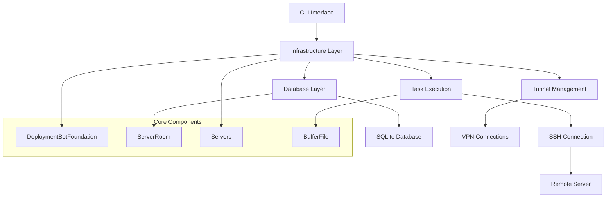

# MachineRoom Documentation

Welcome to the MachineRoom documentation! This comprehensive guide will help you understand, install, and use MachineRoom for managing multiple remote servers.

## 📚 Documentation Overview

### Getting Started
- **[Quick Start Guide](QUICK_START_GUIDE.md)** - Get up and running in minutes
- **[Installation Guide](README.md#installation)** - Detailed installation instructions
- **[Basic Configuration](README.md#configuration)** - Initial setup and configuration

### Core Documentation
- **[Developer Guide](MACHINEROOM_DEVELOPER_GUIDE.md)** - Comprehensive development guide
- **[Examples](EXAMPLES.md)** - Practical examples and use cases
- **[Import Command Documentation](IMPORT_COMMAND.md)** - Detailed server import process
- **[System Design](design/SYSTEM_DESIGN.md)** - Architecture and design patterns

### Reference
- **[Command Reference](README.md#usage)** - Complete command list
- **[Configuration Options](README.md#configuration-options)** - All configuration parameters
- **[File Formats](README.md#server-list-format)** - Server configuration file format

## 🚀 What is MachineRoom?

MachineRoom is a powerful Python-based framework for managing multiple remote servers from a single console interface. It provides centralized control over SSH connections, Docker deployments, VPN tunneling, and server health monitoring.

### Key Features

- **🔧 Multi-Server Management** - Manage hundreds of servers from one interface
- **🔐 SSH Automation** - Automated certificate deployment and connection management  
- **🐳 Docker Integration** - Container deployment and orchestration
- **🌐 VPN Tunneling** - Support for various VPN protocols (L2TP/IPSec, Cisco/IPSec, IKEv2, SSH, WireGuard)
- **💾 Database Persistence** - SQLite-based server metadata storage
- **🔌 Extensible Architecture** - Easy to extend with custom functionality
- **📊 Health Monitoring** - Port scanning and service status checks
- **⚡ Batch Operations** - Execute commands across multiple servers simultaneously

## 🏗️ Architecture



## 📦 Installation

### Prerequisites

- Python 3.8 or higher
- SSH client
- Network access to target servers

### Install from PyPI

```bash
pip3 install machineroom
```

Or for system-wide installation:

```bash
sudo pip3 install machineroom --upgrade
```

### Install from Source

```bash
git clone https://github.com/jjhesk/mymachineroom.git
cd mymachineroom
pip3 install -e .
```

## ⚙️ Configuration

### Basic Setup

Create a configuration script:

```python
#!/usr/bin/env python3
# -*- coding: utf-8 -*-

from machineroom.const import Config

# Configure your data directory (where server lists and cache are stored)
Config.DATAPATH_BASE = "/Users/yourusername/.machineroom"

# Configure your SSH public key path
Config.PUB_KEY = "/Users/yourusername/.ssh/id_rsa.pub"

# Configure your email/identifier
Config.MY_KEY_FEATURE = "your-email@domain.com"

# Optional: Configure additional settings
Config.LOCAL_KEY_HOLDER = "/Users/yourusername/.ssh"
Config.RAM_GB_REQUIREMENT = 4
Config.DOCKER_COMPOSE_VERSION = "2.24.6"

from machineroom.worker import internal_work

if __name__ == '__main__':
    internal_work()
```

### Configuration Options

| Option | Description | Default |
|--------|-------------|---------|
| `DATAPATH_BASE` | Base directory for server lists and cache | `"...._file....locator"` |
| `PUB_KEY` | Path to your SSH public key | `"/Users/xxxx/.ssh/id_rsa.pub"` |
| `LOCAL_KEY_HOLDER` | Directory containing SSH keys | `"/Users/xxxx/.ssh"` |
| `MY_KEY_FEATURE` | Your email/identifier for SSH keys | `"xxx@xxxx"` |
| `RAM_GB_REQUIREMENT` | Minimum RAM requirement for servers | `4` |
| `DOCKER_COMPOSE_VERSION` | Docker Compose version to install | `"2.24.6"` |
| `REMOTE_WS` | Remote workspace path | `"...remote_locator"` |
| `HOME` | Default home directory on remote servers | `"/root"` |

## 🚀 Usage

### Basic Commands

#### List Servers
```bash
python3 your_script.py ls
```
Shows a table of all configured servers with their status, certificates, and installed services.

#### Connect to a Server
```bash
python3 your_script.py <server_id>
```
Establishes an SSH connection to the specified server.

#### Import Server List
```bash
python3 your_script.py import <server_list_file>
```
Imports servers from a configuration file into the local database.

> 📖 **Detailed Documentation**: See [Import Command Documentation](IMPORT_COMMAND.md) for comprehensive guide on file format, examples, and troubleshooting.

#### Scan Server Ports
```bash
python3 your_script.py watch-profile <server_list_file>
```
Scans and records open ports on all servers in the specified list.

#### Manage Certificates
```bash
# Add custom certificate
python3 your_script.py add-cert <server_list_file>

# Remove certificate
python3 your_script.py off-cert <server_list_file>
```

#### Retire Servers
```bash
python3 your_script.py retire <server_list_file>
```
Marks servers as retired in the database.

#### Check Version
```bash
python3 your_script.py v
```
Shows the current MachineRoom version.

### Server List Format

Create a text file with one server per line in the following format:

```
server_id--hostname--username--password--port--ssh_key_path
```

**Field Description:**
- `server_id`: Unique identifier for the server (required)
- `hostname`: IP address or hostname of the server (required)
- `user`: SSH username for authentication (required)
- `password`: SSH password for authentication (optional, can be empty for SSH key auth)
- `port`: SSH port number (optional, defaults to 22)
- `ssh_key_path`: Path to SSH private key file (optional, for key-based authentication)

**Examples:**
```
# Traditional password authentication
web1--192.168.1.10--root--mypassword--22
db1--192.168.1.11--admin--secretpass--2222

# SSH key authentication with custom port
kansas-server--203.0.113.100--admin------22--/Users/yourusername/.ssh/custom_key

# SSH key authentication with default port
prod-web--192.168.1.100--ubuntu------/Users/yourusername/.ssh/prod_key
```

### Examples

#### 1. Initial Setup
```bash
# Create your server list
echo "web1--192.168.1.10--root--mypassword--22" > servers.txt

# Import servers
python3 your_script.py import servers.txt

# List all servers
python3 your_script.py ls
```

#### 2. Connect to a Server
```bash
# Connect to web1 server
python3 your_script.py web1
```

#### 3. Deploy Certificates
```bash
# Add SSH certificates to all servers
python3 your_script.py add-cert servers.txt
# Follow prompts to enter certificate details
```

#### 4. Monitor Server Health
```bash
# Scan ports on all servers
python3 your_script.py watch-profile servers.txt

# Check server status
python3 your_script.py ls
```

### Command Reference

| Command | Description | Example |
|---------|-------------|---------|
| `ls` | List all servers with status | `python3 script.py ls` |
| `<server_id>` | Connect to specific server | `python3 script.py web1` |
| `import <file>` | Import server list | `python3 script.py import servers.txt` |
| `watch-profile <file>` | Scan ports on servers | `python3 script.py watch-profile servers.txt` |
| `add-cert <file>` | Add SSH certificates | `python3 script.py add-cert servers.txt` |
| `off-cert <file>` | Remove SSH certificates | `python3 script.py off-cert servers.txt` |
| `retire <file>` | Mark servers as retired | `python3 script.py retire servers.txt` |
| `v` | Show version | `python3 script.py v` |

## 🔧 Advanced Usage

### Custom Deployment Scripts

MachineRoom provides a powerful foundation for building custom deployment scripts. See the [Developer Guide](MACHINEROOM_DEVELOPER_GUIDE.md) for detailed examples.

### Docker Integration

Deploy and manage Docker containers across multiple servers:

```python
from machineroom.taskbase import docker_launch, exec_docker_compose

# Deploy a container
docker_launch(
    c=connection,
    vol=["/host/path:/container/path"],
    container_name="my-app",
    image="nginx:alpine",
    ver="latest",
    command="",
    network="bridge"
)

# Deploy with Docker Compose
exec_docker_compose(connection, "/app/dir", "docker-compose.yml")
```

### Health Monitoring

Monitor server health and performance:

```python
from machineroom.taskbase import DeploymentBotFoundation

class HealthMonitor(DeploymentBotFoundation):
    def stage_1(self, c: Connection):
        # Check CPU, memory, disk usage
        # Monitor services
        # Generate health reports
        pass
```

### Batch Operations

Execute operations across multiple servers:

```python
from machineroom.infra import Infra2

class BatchDeployer(Infra2):
    def __init__(self, server_file: str):
        super().__init__(server_file)
        # Configure batch operations
        pass
```

## 🛠️ Development

### Extending MachineRoom

MachineRoom is designed to be extensible. You can:

1. **Create custom deployment classes** by extending `DeploymentBotFoundation`
2. **Add new deployment stages** by modifying `Config.STAGE1`
3. **Implement custom health checks** and monitoring
4. **Build specialized deployment scripts** for your use cases

See the [Developer Guide](MACHINEROOM_DEVELOPER_GUIDE.md) for comprehensive development examples.

### Architecture Components

- **CLI Interface** (`worker.py`) - Command-line interface for user interactions
- **Infrastructure Layer** (`infra.py`) - Core server management operations
- **Task Base** (`taskbase.py`) - Deployment and automation foundation
- **Database Layer** (`sql.py`) - SQLite-based server repository
- **Tunnel Management** (`tunnels/`) - VPN and SSH tunnel support
- **Configuration** (`const.py`) - Centralized configuration management

## 🔒 Security Considerations

### Authentication
- **SSH Key Management**: Automated public key deployment with custom key path support
- **Mixed Authentication**: Support for both password and SSH key authentication
- **Certificate Storage**: Secure storage of server metadata and credentials

### Network Security
- **VPN Integration**: Support for various VPN protocols for secure access
- **Tunnel Management**: Automated VPN connection management
- **Port Scanning**: Network security assessment capabilities

## 📊 Monitoring and Health Checks

### Built-in Monitoring
- **Port Scanning**: Detect open ports and services
- **Service Status**: Monitor running services and containers
- **Resource Usage**: Track CPU, memory, and disk usage
- **Network Connectivity**: Test network connectivity and latency

### Health Check Examples
```python
# Check system resources
result = c.run("free -h", warn=True)
result = c.run("df -h /", warn=True)

# Check running services
result = c.run("systemctl is-active nginx", warn=True)

# Test network connectivity
result = c.run("ping -c 1 8.8.8.8", warn=True)
```

## 🚨 Troubleshooting

### Common Issues

1. **SSH Connection Failures**
   ```bash
   # Check SSH key permissions
   chmod 600 ~/.ssh/id_rsa
   ```

2. **Database Lock Issues**
   ```bash
   # Delete and recreate database
   rm /path/to/cache.db
   python3 script.py import servers.txt
   ```

3. **Tunnel Connection Problems**
   ```bash
   # Check tunnel status
   vpnutil list
   ```

### Debug Mode

Enable verbose output:

```python
import logging
logging.basicConfig(level=logging.DEBUG)
```

## 📚 Additional Resources

### Documentation
- [Quick Start Guide](QUICK_START_GUIDE.md) - Get started quickly
- [Developer Guide](MACHINEROOM_DEVELOPER_GUIDE.md) - Comprehensive development guide
- [Examples](EXAMPLES.md) - Practical examples and use cases
- [Import Command Documentation](IMPORT_COMMAND.md) - Detailed import process
- [System Design](design/SYSTEM_DESIGN.md) - Architecture overview

### Support
- Check the troubleshooting section for common issues
- Review examples for implementation patterns
- Examine the developer guide for advanced usage

## 🤝 Contributing

MachineRoom is an open-source project. Contributions are welcome! Please see the project repository for contribution guidelines.

## 📄 License

This project is licensed under the Apache License 2.0. See the LICENSE file for details.

---

**Ready to get started?** Check out the [Quick Start Guide](QUICK_START_GUIDE.md) to begin managing your servers with MachineRoom! 🚀
