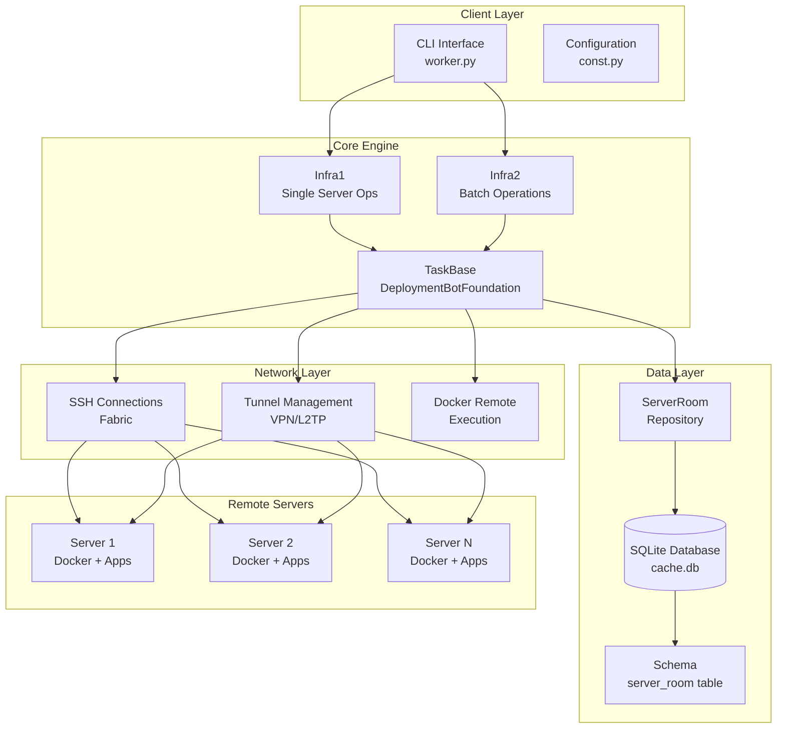
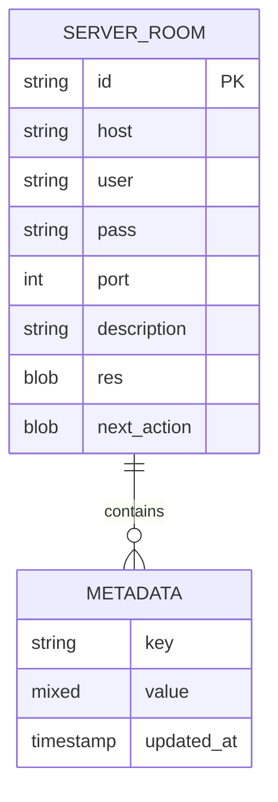
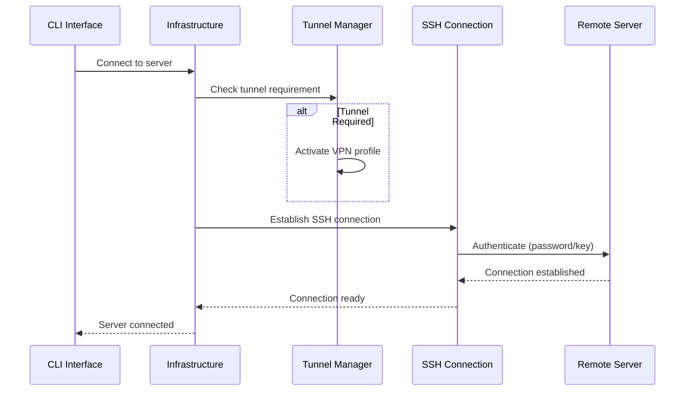
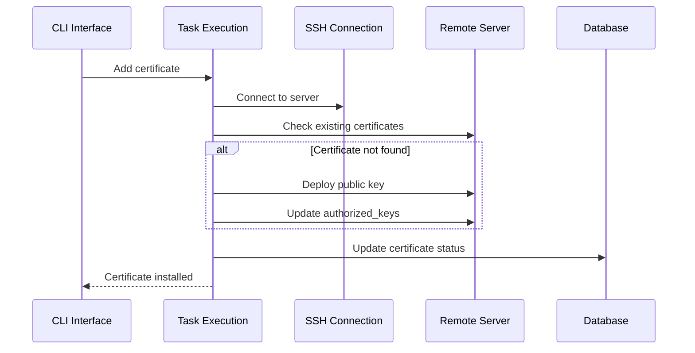
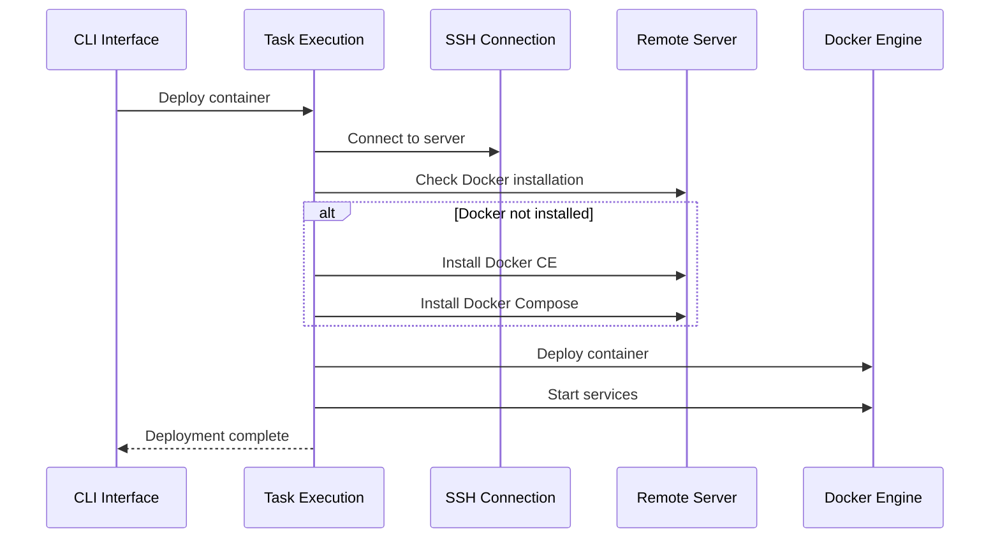

# MachineRoom System Design

## Table of Contents
1. [System Overview](#system-overview)
2. [High-Level Architecture](#high-level-architecture)
3. [Core Components](#core-components)
4. [Data Model](#data-model)
5. [Key Workflows](#key-workflows)
6. [Design Patterns](#design-patterns)
7. [Configuration & Deployment](#configuration--deployment)
8. [Security Considerations](#security-considerations)

## System Overview

### Purpose and Goals
MachineRoom is a centralized server management system designed to:
- **Locate and manage multiple machines** from a single console interface
- **Streamline server operations** through automated deployment and configuration
- **Provide centralized control** for authentication, certificates, and Docker containers
- **Support VPN tunneling** for secure access to remote infrastructure
- **Enable scalable infrastructure management** as operations grow

### Key Capabilities
- **Server Discovery & Management**: Import and manage server lists with authentication details
- **SSH Certificate Management**: Automated SSH key deployment and certificate installation
- **Docker Container Orchestration**: Deploy and manage Docker containers across multiple servers
- **VPN Tunnel Support**: L2TP/IPSec, Cisco/IPSec, IKEv2, SSH tunneling
- **Health Monitoring**: Port scanning, container status checking, and system validation
- **Batch Operations**: Execute commands across multiple servers simultaneously

## High-Level Architecture



## Core Components

### 1. Configuration Management (`const.py`)

**Purpose**: Centralized configuration and constants management

**Key Classes**:
- `Config`: Main configuration class inheriting from `COMMAND_PATH`, `PROJECT1`, `PROJECT2`
- `TunnelType`: Enum for different VPN tunnel types (L2TP/IPSec, Cisco/IPSec, IKEv2, SSH, etc.)

**Key Configuration Options**:
```python
DATAPATH_BASE: str = "...._file....locator"  # Base data directory
PUB_KEY: str = "/Users/xxxx/.ssh/id_rsa.pub"  # SSH public key path
LOCAL_KEY_HOLDER: str = "/Users/xxxx/.ssh"    # SSH key directory
MY_KEY_FEATURE: str = "xxx@xxxx"              # Key identifier
REMOTE_WS: str = "...remote_locator"          # Remote workspace
RAM_GB_REQUIREMENT: int = 4                   # Minimum RAM requirement
DOCKER_COMPOSE_VERSION: str = "2.24.6"        # Docker Compose version
```

### 2. Data Layer (`sql.py`)

**Purpose**: Database abstraction and server metadata management

**Key Classes**:
- `ToolDb`: Base database controller with CRUD operations
- `ServerRoom`: Server repository extending `ToolDb`

**Database Schema**:
```sql
CREATE TABLE server_room (
    id CHAR(100) PRIMARY KEY,           -- Server identifier
    host CHAR(100) NOT NULL,            -- Server IP/hostname
    user CHAR(100) NOT NULL,            -- SSH username
    pass CHAR(100) NOT NULL,            -- SSH password
    port NUMBER(5) NOT NULL,            -- SSH port (default: 22)
    description CHAR(1000),             -- Server description
    res BLOB(100000) NOT NULL,          -- JSON metadata (certificates, installed software, etc.)
    next_action BLOB(100000) NOT NULL   -- JSON for scheduled actions
);
```

**Metadata Structure** (`res` field):
```json
{
    "identity_cert_installed": true,
    "local_cert_path": "/Users/username/.ssh/custom_key",
    "docker_compose_installed": true,
    "python3_installed": true,
    "daed_installed": true,
    "yacht_installed": true,
    "tunnel_profile": "vpn-profile-name",
    "home_path": "/root",
    "ports": [22, 80, 443, 8080],
    "retired": false
}
```

**Certificate Path Resolution**:
- If `local_cert_path` is set: uses custom certificate path
- If not set: defaults to `~/.ssh/id_rsa` for backward compatibility
- Path expansion with `~` is supported automatically

### 3. Task Execution Engine (`taskbase.py`)

**Purpose**: Core execution engine for remote server operations

**Key Classes**:
- `DeploymentBotFoundation`: Abstract base class for deployment operations
- `BufferFile`: Utility for creating and managing remote execution scripts

**Key Methods**:
- `copy_id()`: SSH key deployment
- `detect_cert()`: Certificate validation
- `docker_launch()`: Container deployment
- `exec_shell_program()`: Remote command execution
- `install_docker_ce()`: Docker installation
- `install_clash_network()`: Network proxy setup

### 4. Infrastructure Orchestration (`infra.py`)

**Purpose**: High-level orchestration for single and batch operations

**Key Classes**:
- `Infra1`: Single server operations with tunnel support
- `Infra2`: Batch operations across multiple servers

**Deployment Stages**:
```python
STAGE1 = ["cert", "docker", "env"]  # Core deployment stages
```

**Stage Processing**:
1. **cert**: SSH certificate installation and validation
2. **docker**: Docker CE and Docker Compose installation
3. **env**: Environment setup and path configuration

### 5. Worker Interface (`worker.py`)

**Purpose**: CLI interface and command routing

**Key Commands**:
- `ls`: List all servers with status indicators
- `import`: Import server configuration from file
- `scanports`: Scan open ports on servers
- `add-cert`: Add custom SSH certificates
- `retire`: Mark servers as retired
- `connect <server_id>`: SSH connection to specific server

**Command Aliases**:
```python
CMD_LIST = ["ls", "show", "list", "tell"]
CMD_SCAN_DOCKER = ["scan_docker", "scandocker", "validation", "valid"]
CMD_IMPORT = ["import", "update_file", "update_conf", "updateconfig"]
```

### 6. Tunnel Management (`tunnels/`)

**Purpose**: VPN and tunnel connection management

**Key Components**:
- `conn.py`: macOS VPN utility integration (`vpnutil`)
- `fork.py`: L2TP/IPSec tunnel implementation

**Supported Tunnel Types**:
- L2TP/IPSec
- Cisco/IPSec  
- IKEv2
- SSH tunneling
- WireGuard
- PPTP

## Data Model

### Server Configuration Format
Servers are defined in text files with the following format:
```
server_id--host--user--password--port--ssh_key_path
```

**Field Description:**
- `server_id`: Unique identifier for the server (required)
- `host`: IP address or hostname of the server (required)
- `user`: SSH username for authentication (required)
- `password`: SSH password for authentication (optional, can be empty for SSH key auth)
- `port`: SSH port number (optional, defaults to 22)
- `ssh_key_path`: Path to SSH private key file (optional, for key-based authentication)

**Examples**:
```
# Traditional password authentication
web-server-01--192.168.1.100--root--password123--22
db-server-01--192.168.1.101--admin--securepass--2222

# SSH key authentication with custom port
kansas-server--203.0.113.100--admin------22--/Users/yourusername/.ssh/custom_key

# SSH key authentication with default port
prod-web--192.168.1.100--ubuntu------/Users/yourusername/.ssh/prod_key
```

**Tunnel Configuration**:
```
#tunnel-profile-name--L2TP/IPSEC--tunnel-server--username--password
```

### Database Relationships



## Key Workflows

### 1. Server Connection Workflow



### 2. Certificate Management Workflow



### 3. Docker Deployment Workflow



## Design Patterns

### 1. Template Method Pattern
**Implementation**: `DeploymentBotFoundation` class
```python
class DeploymentBotFoundation:
    def stage_0(self): pass  # Abstract method
    def stage_1(self, c: Connection): pass  # Abstract method
    
    def run_conn(self, callback_x=None):
        # Template method defining the algorithm
        self.stage_0()
        c = self._est_connection()
        self.stage_1(c)
        if callable(callback_x):
            callback_x(c)
```

### 2. Strategy Pattern
**Implementation**: `TunnelType` enum for different VPN strategies
```python
class TunnelType(Enum):
    NO_TUNNEL = 0
    L2TP_IPSEC = 1
    CISCO_IPSEC = 2
    IKEV2 = 3
    SSH = 9
    
    @classmethod
    def Recognize(cls, what: str):
        # Strategy selection based on input
        if "l2tp/ipsec" in what.lower():
            return cls.L2TP_IPSEC
        # ... other strategies
```

### 3. Repository Pattern
**Implementation**: `ServerRoom` class for data access abstraction
```python
class ServerRoom(ToolDb):
    def get_info(self): return self.get_host_info(self._tblembr, self.server_id)
    def update_res_kv(self, k: str, val): # Update metadata
    def is_cert_installed(self): return self._is_what_installed("identity_cert_installed")
    def cert_install(self): self._update_what_installed("identity_cert_installed")
```

## Configuration & Deployment

### Environment Setup
1. **Python Environment**: Python 3.11+ with virtual environment
2. **Dependencies**: Fabric, Paramiko, SQLiteAsJSON, tabulate
3. **System Requirements**: macOS with VPN utilities, SSH client

### Configuration Files
- **Server Lists**: Text files with server definitions
- **SSH Keys**: Public/private key pairs for authentication
- **Database**: SQLite database for metadata storage
- **Tunnel Profiles**: VPN configuration files

### Deployment Stages
```python
STAGE1 = ["cert", "docker", "env"]  # Core stages
```

**Stage Details**:
- **cert**: SSH certificate installation and validation
- **docker**: Docker CE, Docker Compose installation
- **env**: Environment variables and system paths
- **python**: Python 3 installation
- **daed**: DAE proxy installation
- **watchtower**: Container auto-update service
- **clash**: Network proxy configuration
- **yacht**: Container management UI

### Remote Workspace Structure
```
/remote/workspace/
├── cache/           # Application cache and data
├── assets/          # Static assets and files
└── docker-compose.yml  # Container definitions
```

## Security Considerations

### Authentication
- **SSH Key Management**: Automated public key deployment with custom key path support
- **Mixed Authentication**: Support for both password and SSH key authentication
- **Password Authentication**: Fallback for initial setup
- **Certificate Validation**: Regular certificate status checking
- **Custom SSH Key Paths**: Support for specifying custom SSH private key files

### Network Security
- **VPN Tunneling**: Encrypted connections for remote access
- **Port Scanning**: Network security assessment
- **Firewall Management**: Automated port configuration

### Data Protection
- **Encrypted Storage**: Sensitive data in SQLite with access controls
- **Secure Transmission**: SSH encryption for all communications
- **Access Logging**: Command execution tracking

### Best Practices
- Regular certificate rotation
- Secure server file permissions
- Network segmentation through VPNs
- Container security scanning
- Automated security updates

---

## Conclusion

The MachineRoom system provides a robust, scalable solution for managing multiple servers from a centralized console. Its modular architecture, comprehensive security features, and automated deployment capabilities make it suitable for both small-scale operations and large infrastructure management.

The system's design emphasizes:
- **Simplicity**: Easy-to-use CLI interface
- **Reliability**: Robust error handling and connection management
- **Scalability**: Support for managing hundreds of servers
- **Security**: Multiple layers of authentication and encryption
- **Automation**: Reduced manual intervention through staged deployments
